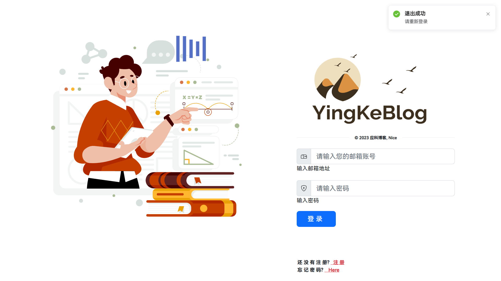

# 项目介绍

> **应科博客** 是一个由JavaEE开发的博客系统，基于经典主流技术组合（SpringBoot、Sa-token、MyBatis、Jwt、Vue），内置模块如下:
>
> 登录注册、每日刷题、书写文章、博客管理、动态博客分类、博客发布、用户评论、权限校验、个人信息管理、定时任务、视频播放等。

演示视频: https://www.bilibili.com/video/BV1nh41177Rv/ (有不好的地方 请多多指正)
演示图片:

## 一.项目架构

### 1.技术栈介绍

#### (1)后端

1. SpringBoot2: 后端服务开发框架
2. MyBatis: 数据库交互与管理
3. MySQL: 关系型数据库存储数据
4. Druid: 数据库连接池
5. Redis: 数据缓存和业务逻辑实现
6. Sa-token: 身份与权限管理(最新国产开源安全框架)
7. JWT: 前后端分离令牌
9. AES: 对称加密算法
10. PageHelper: 数据分页查询
11. Boot-mail: 发送QQ邮件
12. Hutool: Java工具包
13. OSS: 阿里云OSS存储
14. Lombok: 自动插入编辑器并构建工具
15. Jackson: JavaJSON解析器

#### (2)前端

1. Vue2: 前端服务开发框架
2. VueX: 数据持久化
3. VueRouter: 路由
4. Axios: 异步通信
5. Element-ui+Bootstrap: 前端样式/组件
6. 其他第三方插件: 
   1. mavon-editor(构建markdown编辑器)
   2. marked(markdown转html)
   3. highlight.js(代码高亮)
   4. nprogress(进度条)
   5. animate.css(动画库)
   6. vue-aplayer(视频播放器)
   7. echarts(数据可视化框架)
   8. codemirror(带提示功能的代码编辑器)

### 2.运行环境

开发工具:

1. IDEA2022.3.1(后端)
2. WebStorm2022.3.1(前端)
3. Navicat16(操作MySQL)
4. RESP(操作Redis)

服务开发版本:

1. SpringBoot 2.7.9
1. 其他相关依赖版本如图:

3. Maven 3.8.1
4. Vue 2.6.14
5. Node 16.18.1
6. mysql 8.30
7. Redis 7.0

### 3.架构设计与分析

整个项目采用主流的前后端分离项目架构，后端使用SpringBoot开发，前端使用Vue开发。项目的用例设计思路如下：

> 基本用例：博客列表展示、博客详情展示、博客搜索、博客分类列表展示、友链展示、关于我展示、登陆/注册、展示/修改个人信息、我的博客列表管理、我的资源列表管理、他人空间展示（信息、博客、学习记录）、博客留言模块、博客编辑/发表、学习情况编辑/发表、退出/注销。
> 权限等级：admin>teacher>user
> admin：拥有博客系统的所有权限，可以登陆后台管理系统，admin权限不存在注册渠道。
> teacher：拥有上传题目、题目修改、题目评分、博客浏览、资源浏览、博客发布、评论权限
> user：拥有博客浏览、资源浏览、博客发布、资源发布、资源浏览、评论权限，用户在注册时默认为user权限。
